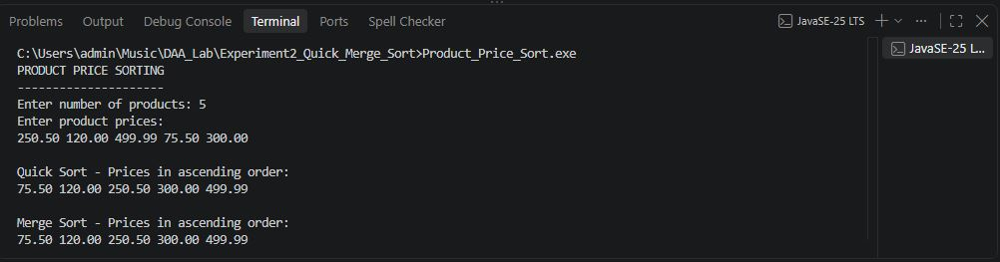

# Experiment No. 2

## Quick Sort and Merge Sort Using Array as a Data Structure

---

## Aim

To implement **Quick Sort and Merge Sort** using Array as a Data Structure and apply them to real-world applications.

---

## Objective

* To understand the concept of Quick Sort.
* To understand the concept of Merge Sort.
* To implement Quick Sort using an array.
* To implement Merge Sort using an array.
* To apply sorting techniques to real-world applications.
* To analyze the time and space complexity of Quick Sort and Merge Sort.
* To compare the performance of Quick Sort and Merge Sort.

---

## Theory

**Sorting** is the process of arranging data in a specific order, such as ascending or descending order.

**Quick Sort** and **Merge Sort** are efficient sorting techniques based on the divide-and-conquer approach.

### Quick Sort

Quick Sort selects an element as a **pivot** and partitions the array around the pivot.

Elements smaller than the pivot are placed on the left side, while elements greater than the pivot are placed on the right side.

The same process is recursively applied to the left and right parts of the array.

### Merge Sort

Merge Sort divides the array into smaller subarrays until each subarray contains a single element.

The subarrays are then merged in sorted order to form the final sorted array.

---

# Applications

This experiment contains three real-world applications:

1. **Student Marks Sorting**
2. **Employee Salary Sorting**
3. **Product Price Sorting**

---

# Application 1: Student Marks Sorting

### Description

This program sorts the **marks of students** in ascending order using Quick Sort.

### Source File

`Student_Marks_Quick_Sort.c`

### Sample Input

```text
Enter number of students: 4
Enter marks:
78 45 92 61 
```


### Output 


### Application

Quick Sort can be used in a **Student Management System** to arrange student marks in ascending order for analysis and ranking.


---

# Application 2: Employee Salary Sorting

### Description

This program sorts the **salaries of employees** in ascending order using Merge Sort.

### Source File

`Employee_Salary_Merge_Sort.c`

### Sample Input

```text
Enter number of employees: 4
Enter employee salaries:
45000 32000 58000 41000 
```

### Output 


### Application

Merge Sort can be used in an **Employee Management System** to arrange employee salaries for payroll analysis and comparison.

---

# Application 3: Product Price Sorting

### Description

This program sorts **product prices** using both Quick Sort and Merge Sort and displays the sorted results for comparison.

### Source File

`Product_Price_Sort.c`

### Sample Input

```text
Enter number of products: 5
Enter product prices:
250.50 120.00 499.99 75.50 300.00
```

### Output



### Application

Quick Sort and Merge Sort can be used in an **E-Commerce System** to arrange product prices for price comparison and product filtering.

# Algorithm

## Quick Sort

```text
1. Select an element as the pivot.
2. Partition the array around the pivot.
3. Place smaller elements on the left side of the pivot.
4. Place greater elements on the right side of the pivot.
5. Recursively apply Quick Sort to the left subarray.
6. Recursively apply Quick Sort to the right subarray.
7. Continue until the subarray contains one or zero elements.
```

---

## Merge Sort

```text
1. Divide the array into two halves.
2. Recursively divide each half until single elements remain.
3. Compare elements of the divided subarrays.
4. Merge the elements in sorted order.
5. Continue merging until the complete array is sorted.
```

---

# Time Complexity

| Case         | Quick Sort | Merge Sort |
| ------------ | ---------- | ---------- |
| Best Case    | O(n log n) | O(n log n) |
| Average Case | O(n log n) | O(n log n) |
| Worst Case   | O(n²)      | O(n log n) |

---

# Space Complexity

| Sorting Algorithm | Space Complexity |
| ----------------- | ---------------- |
| Quick Sort        | O(log n) Average |
| Merge Sort        | O(n)             |

Quick Sort requires recursive stack space, while Merge Sort requires additional temporary array space for merging.

---

# Advantages

## Quick Sort

* Fast and efficient for average cases.
* Requires less additional memory.
* Works well for large datasets.
* Easy to implement using arrays.

## Merge Sort

* Provides consistent O(n log n) time complexity.
* Efficient for large datasets.
* Suitable when stable sorting is required.
* Performance does not depend on the initial order of elements.

---

# Limitations

## Quick Sort

* Worst-case time complexity can be O(n²).
* Performance depends on pivot selection.
* Recursive implementation requires stack memory.

## Merge Sort

* Requires additional memory for temporary arrays.
* Uses more space compared to Quick Sort.
* May require additional processing for merging.

---

# Applications

Quick Sort and Merge Sort can be used in:

* Student Marks Management Systems
* Employee Payroll Systems
* E-Commerce Systems
* Product Price Comparison
* Database Sorting
* Ranking Systems
* Salary Analysis
* Inventory Management
* Data Analysis
* Large Dataset Processing

---

# Comparison

| Feature          | Quick Sort         | Merge Sort         |
| ---------------- | ------------------ | ------------------ |
| Technique        | Divide and Conquer | Divide and Conquer |
| Best Case        | O(n log n)         | O(n log n)         |
| Average Case     | O(n log n)         | O(n log n)         |
| Worst Case       | O(n²)              | O(n log n)         |
| Space Complexity | O(log n) Average   | O(n)               |
| In-place         | Yes                | No                 |
| Stability        | Not Stable         | Stable             |
| Performance      | Fast in practice   | Consistent         |

---

# Files in This Experiment

```text
Experiment2_Quick_Merge_Sort/
│
├── Student_Marks_Quick_Sort.c
├── Employee_Salary_Merge_Sort.c
├── Product_Price_Sort.c
├── README.md
│
└── Output/
    ├── App1_Student_Marks_Output.png
    ├── App2_Employee_Salary_Output.png
    └── App3_Product_Price_Output.png
```

---

# Conclusion

Quick Sort and Merge Sort are efficient sorting techniques based on the **Divide and Conquer** approach.

In this experiment, Quick Sort and Merge Sort were successfully implemented using **Array as a Data Structure** and applied to three real-world applications:

1. Student Marks Sorting
2. Employee Salary Sorting
3. Product Price Sorting

Quick Sort provides **O(n log n)** average-case time complexity but can take **O(n²)** in the worst case. Merge Sort provides consistent **O(n log n)** time complexity but requires **O(n)** additional space.

Therefore, Quick Sort is suitable when memory usage and average performance are important, while Merge Sort is suitable when consistent performance and stable sorting are required.
